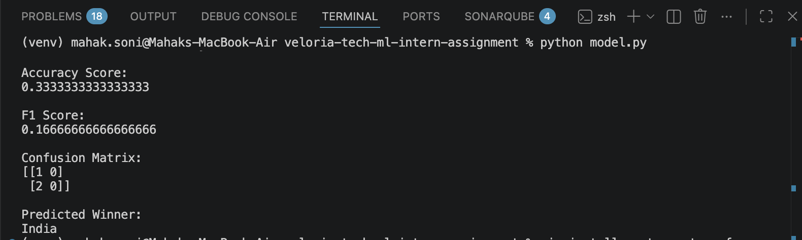
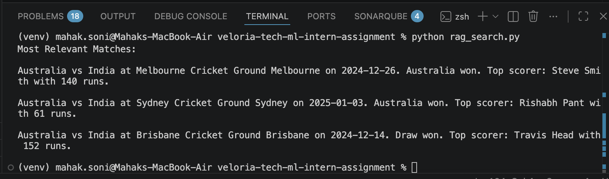

# Cricket Match Prediction and Semantic Search Project

## About This Project

This project was created as part of the Veloria Tech AI/ML Internship Assignment.

In this project, I worked on:

- Collecting cricket match data
- Building a machine learning prediction model
- Creating a semantic search system using vector embeddings

The project was built using Python libraries like Pandas, Scikit-learn, and Sentence Transformers.

---

# TASK 1 — Data Collection Using Web Scraping

## What I Did

I created a Python script called `scraper.py` to collect cricket match data and save it into a CSV file.

The collected information includes:

- Match date
- Team 1 name
- Team 2 name
- Venue
- Match winner
- Top scorer
- Top score

The data was stored in:

match_data.csv

---

# TASK 2 — Machine Learning Prediction Model

## What I Did

I created a machine learning model using Scikit-learn to predict the winner of a cricket match.

I used the Random Forest algorithm because it handles sports data well and can learn patterns from previous matches.

The model used features like:

- Team 1
- Team 2
- Venue

These values were converted into numerical form so the model could process them.

---

## Model Evaluation

The model evaluation included:

- Accuracy Score
- F1 Score
- Confusion Matrix

I also tested the model by predicting the winner of a new match.

---

# TASK 3 — Semantic Search Using Vector Embeddings

## What I Did

I created a semantic search system using Sentence Transformers.

First, every cricket match record was converted into a text sentence.

Example:

India vs Australia at Melbourne on 15 Jan 2024. Australia won.

Then embeddings were generated using:

sentence-transformers

The semantic search system allows users to search using normal language queries.

Example:

Show me matches where Australia won

The program returns the 3 most relevant matches from the dataset.

---

# Files Included

- scraper.py
- match_data.csv
- model.py
- rag_search.py
- requirements.txt
- README.md

---

# Technologies Used

- Python
- Pandas
- Scikit-learn
- Sentence Transformers
- NumPy

---

# How to Run the Project

## Step 1 - Clone or Download the Project

Download the project folder and open it in VS Code.

Open terminal inside the project folder.

---

## Step 2 - Install Dependencies

pip install -r requirements.txt

---

## Step 3 - Run Web Scraping Script

python scraper.py

---

## Step 4 - Run Machine Learning Model

python model.py

---

## Step 5 - Run Semantic Search

python rag_search.py

---

# Results

## Machine Learning Results

- Accuracy Score: 0.33
- F1 Score: Calculated using Scikit-learn
- Confusion Matrix was successfully generated

The model was also able to predict the winner of a new cricket match.

---

# Sample Output

## Prediction Model Output

Predicted Winner:

India

## Semantic Search Output

Example Query:

Show me matches where Australia won

The program returned the 3 most relevant cricket matches from the dataset.

---

# Challenges Faced

Some challenges I faced during this project were:

- Understanding how machine learning models work
- Converting text data into numerical values
- Working with vector embeddings for semantic search
- Installing and managing Python libraries
- Understanding how semantic similarity works

I solved these problems by testing the code step by step and learning how each part works.

---

# Output Screenshots

## Model Prediction Output

---

## Semantic Search Output

# Conclusion

This project helped me learn the practical basics of Python, web scraping, machine learning, and semantic search.

In Task 1, I collected cricket match data from a public website and stored it in a CSV file using Python.

In Task 2, I built a machine learning prediction model using the Random Forest algorithm to predict the winning team. I also evaluated the model using accuracy score, F1 score, and confusion matrix.

In Task 3, I implemented semantic search using vector embeddings and sentence-transformers to find the most relevant cricket matches based on user queries.

Overall, this assignment improved my understanding of real-world AI/ML workflows and gave me hands-on experience working with datasets, Python libraries, and machine learning concepts.

Thank you for reviewing this project.